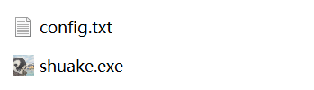
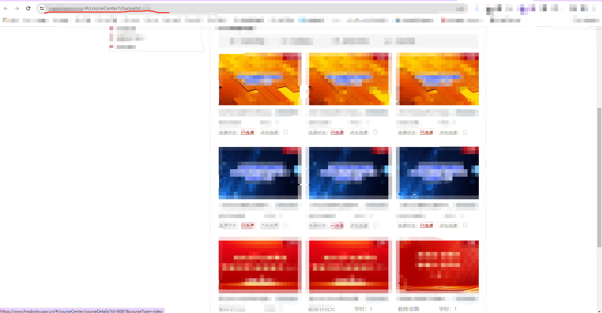
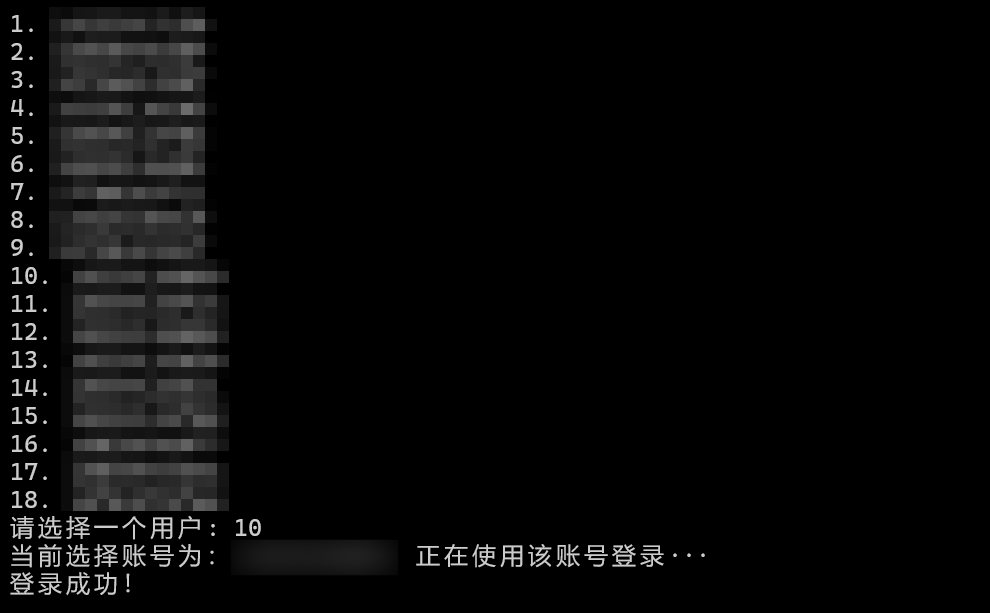
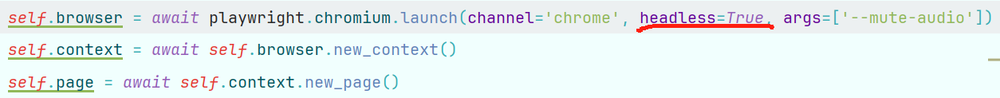
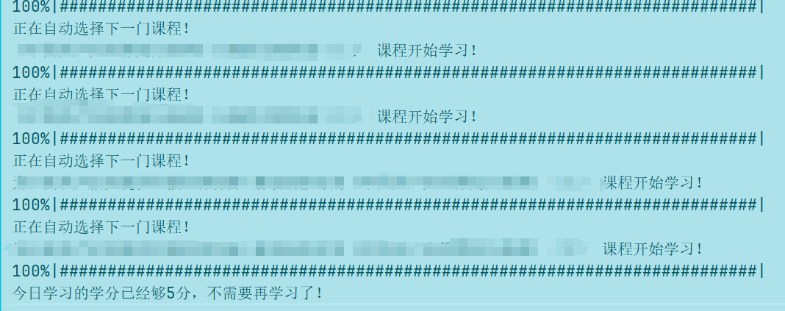

# 干部网络学院刷课

INShuaKe是使用PYTHON语言编写的**免费**SHUAKE工具，只限于HN地区。

目前有两种方法运行，**第一种软件运行（推荐使用）**，第二种PYTHON代码运行。

有任何问题随时提问Issue，本人看到会第一时间回复。

# 郑重声明

**老哥们没必要因为这个东西去其他地方花个几十块，不如给孩子买点零食吃！！！**

**老哥们没必要因为这个东西去其他地方花个几十块，不如给孩子买点零食吃！！！**

**老哥们没必要因为这个东西去其他地方花个几十块，不如给孩子买点零食吃！！！**

**欢迎各位老哥维护本项目！！！**

# 更新说明

- May 9, 2024 最新使用playwright库重新写的，并且加入课程进度条，比selenium更方便，直接装库运行命令即可，不需要再配置Chromedriver了
- May 11, 2024 更新README.md以及调整默认浏览器为无窗口模式
- January 2, 2024 **更新EXE运行文件**！使用请见说明！

# 使用方法

## Exe文件运行

### 一、文件结构

保持shuake.exe和config.txt在同一个目录下



### 二、config.txt文件格式


```bash
COURSER_LINK = "xxx.xxx.xxx/#/courseCenter?channelld=xxx"   # 填写你需要刷课的网址xxx

# xxx                            # 账号1
xxxxxxxxxxx = xxxxxxxxx          # 格式为： 手机号=密码

# xxx
xxxxxxxxxxx = xxxxxxxxx

# xxx
xxxxxxxxxxx = xxxxxxxxx

```

可以继续添加账号

COURSER_LINK 填写方法：

找到你要刷的课程页，如下图所示，当前url地址即为COURSER_LINK，将其复制填入




### 三、运行截图



## Python代码运行

### 一、环境配置

#### 1、python环境

```python
# 使用python3运行此项目[我自己的环境是Python 3.11.5，是使用miniconda装的python环境比较方便]
# 安装完python3
# 使用如下命令安装所需要的库
强烈推荐使用miniconda !!!!!!  我本地的python装库不兼容报错了非常烦，就下了miniconda创建了一个新环境，把conda环境变量配好
1、使用conda创建新环境
conda create -n shuake python=3.11
2、在当前环境下用pip安装所需要的库
conda activate shuake
pip install -r requirements.txt
3、装库如果你无法挂t，就换源用以下的，不行了你在换个阿里云的。
清华源
pip install -r requirements.txt -i https://pypi.tuna.tsinghua.edu.cn/simple/ 
阿里云源
pip install -r requirements.txt -i https://mirrors.aliyun.com/pypi/simple/
4、安装需要的浏览器
playwright install
5、推荐可以Pycharm搭配脚本，运行同样在终端运行，如果右键则不会显示进度条，非常方便
```

### 二、如何运行

#### 1、配置个人账号密码，所需要刷课的网址

打开env文件夹下的config.py，并配置以下信息

```python
USER_NUMBER = "xxx"                                         # 填写你的账号xxx
USER_PASSWD = "xxx"                                         # 填写你的密码xxx
COURSER_LINK = "xxx.xxx.xxx/#/courseCenter?channelld=xxx"   # 填写你需要刷课的网址xxx
```

COURSER_LINK 填写方法：

找到你要刷的课程页，如下图所示，当前url地址即为COURSER_LINK，将其复制填入


#### 2、开始运行

```python
python main.py
```

### 三、浏览器无窗口模式



将headless设置为True即可不弹出浏览器无浏览器运行，设置为False即可弹出浏览器运行，默认为True。

### 四、运行截图




# 关于干部网络学院网课

个人认为，网课本身受众就是国家的栋梁，本人不欢迎不热爱国家的人使用本项目。

干部网络学院网课聚合了大量丰富的知识性，内容严谨，专业性强，能从中学到很多知识，开阔眼界。推荐大家自发积极学习网课。

# 关于INShuaKe

INShuaKe 仅提供给上班上学期间工作学业繁重，抽不出时间完成网课任务的非程序员。

本人有空会进行维护更新，欢迎大家一起维护更新。
# 已知问题
1、目前遇到实景课程无法刷，遇到会报错，报错了就换个其他的课程链接就行，等我有空更新完善完善。

2、网络不好也会报错，重新运行即可，这个我也没法哈哈，等我再聪明点。
