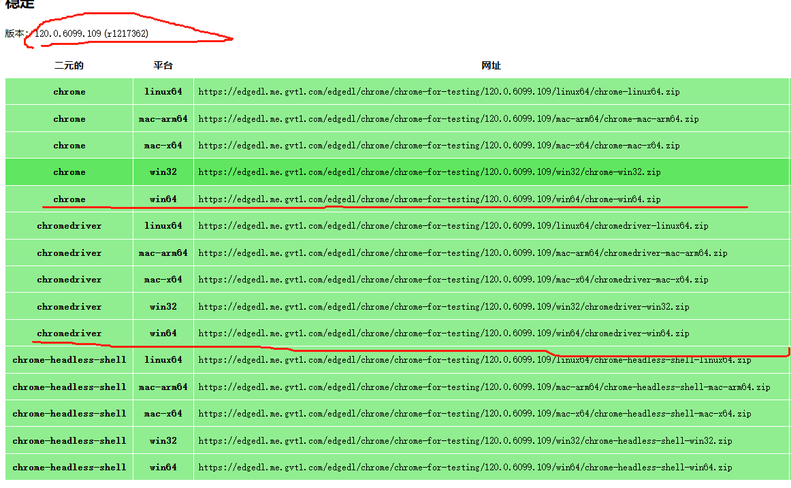
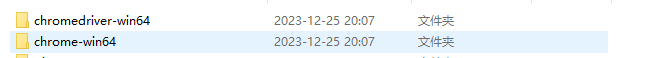
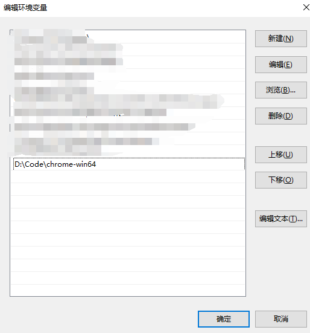
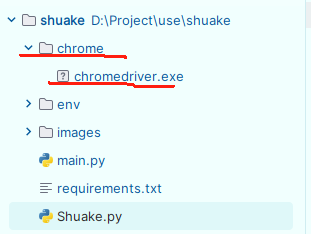
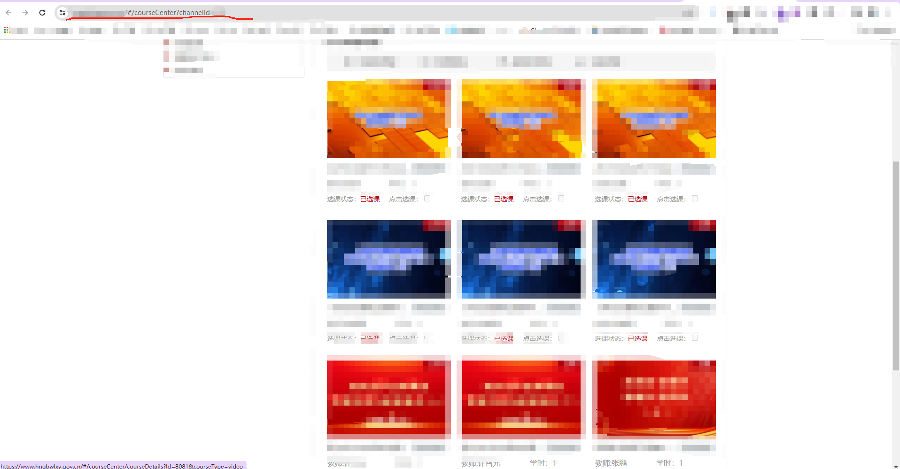
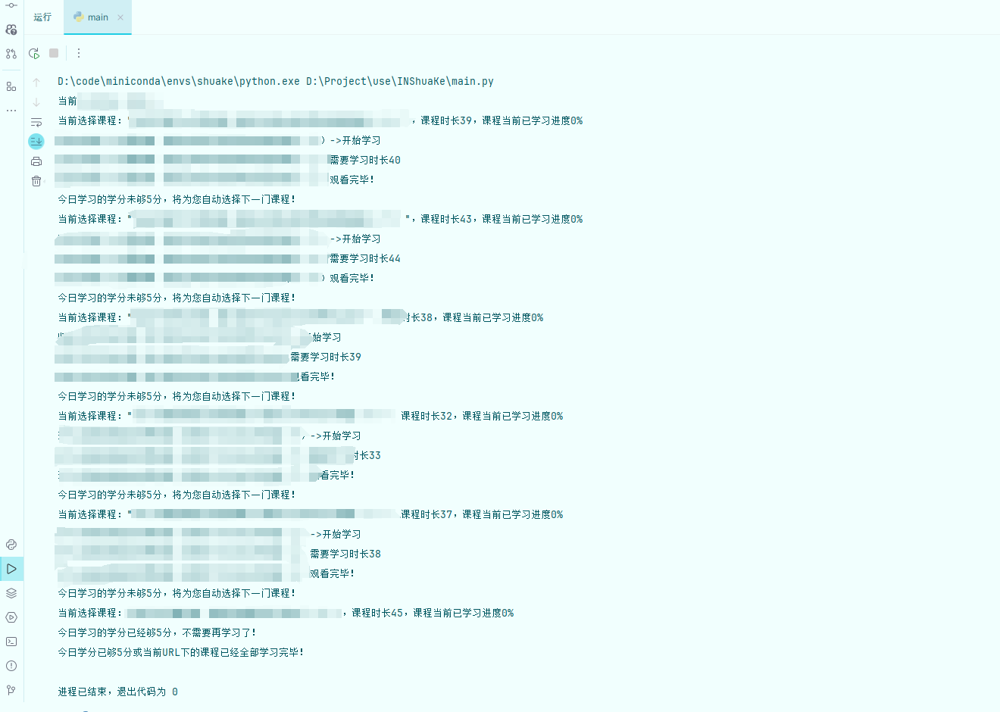

# 网络干部学院刷课

INShuaKe是使用python语言编写的shuake工具，运行一次刷够5分

# 关于网络干部学院网课

个人认为，网课本身受众就是国家的栋梁，本人不欢迎不热爱国家的人使用本项目。

网络干部学院网课聚合了大量丰富的知识性，内容严谨，专业性强，能从中学到很多知识，开阔眼界。推荐大家自发积极学习网课。

# 关于INShuaKe

INShuaKe 仅提供给上班上学期间工作学业繁重，抽不出时间完成网课任务的非程序员。

本人有空会进行维护更新，欢迎大家一起维护更新。

# 使用方法

## 一、环境配置

📢 请务必花一点时间阅读此文档，有助于你快速使用

### 1、Chromedriver

前往[Chrome for Testing 可用性 (googlechromelabs.github.io)](https://googlechromelabs.github.io/chrome-for-testing/)下载同一个版本的chrome以及chromedriver，如下图所示



下载完后将两个压缩包解压，并将chrome-win64文件夹添加进系统环境变量（需要将系统环境变量中已有的Google全部删掉）





将chromedriver-win64文件夹的chromedriver.exe复制到下图所示地方，chrome环境配置即可



### 2、python环境

```python
# 使用python3运行此项目[我自己的环境是Python 3.11.5，是使用miniconda装的python环境比较方便]
# 安装完python3
# 使用如下命令安装所需要的库
pip install -r requirements.txt
```

## 二、如何运行

### 1、配置个人账号密码，所需要刷课的网址，以及页数（默认从第一页开始找未刷的课程，你可以指定从那一页开始）

打开env文件夹下的config.py，并配置以下信息

```python
CHROME_DRIVER_PATH = './chrome/chromedriver.exe'            # 默认chromedriver路径不动
USER_NUMBER = "xxx"                                         # 填写你的账号xxx
USER_PASSWD = "xxx"                                         # 填写你的密码xxx
COURSER_LINK = "xxx.xxx.xxx/#/courseCenter?channelld=xxx"   # 填写你需要刷课的网址xxx
PAGE_NUM = 1                  # 从哪一页开始刷课，默认从第1页，如果你第一页课程刷完可更换为其他页数
```

COURSER_LINK 填写方法：

找到你要刷的课程页，如下图所示，当前url地址即为COURSER_LINK，将其复制填入



### 2、开始运行

```python
python main.py
```

# 运行说明

chromedriver在后台运行并不会弹出浏览器窗口，本人在测试时发现弹出窗口运行的方式在浏览器小化会弹出禁止拖动的弹窗影响学习进度（因本人时间有限，未对此优化），所以设置静默模式，目前静默模式应该没有弹出此弹窗

```python
options.add_argument('--window-size=1920,1080')
options.add_argument('--headless')
```

# 运行截图


